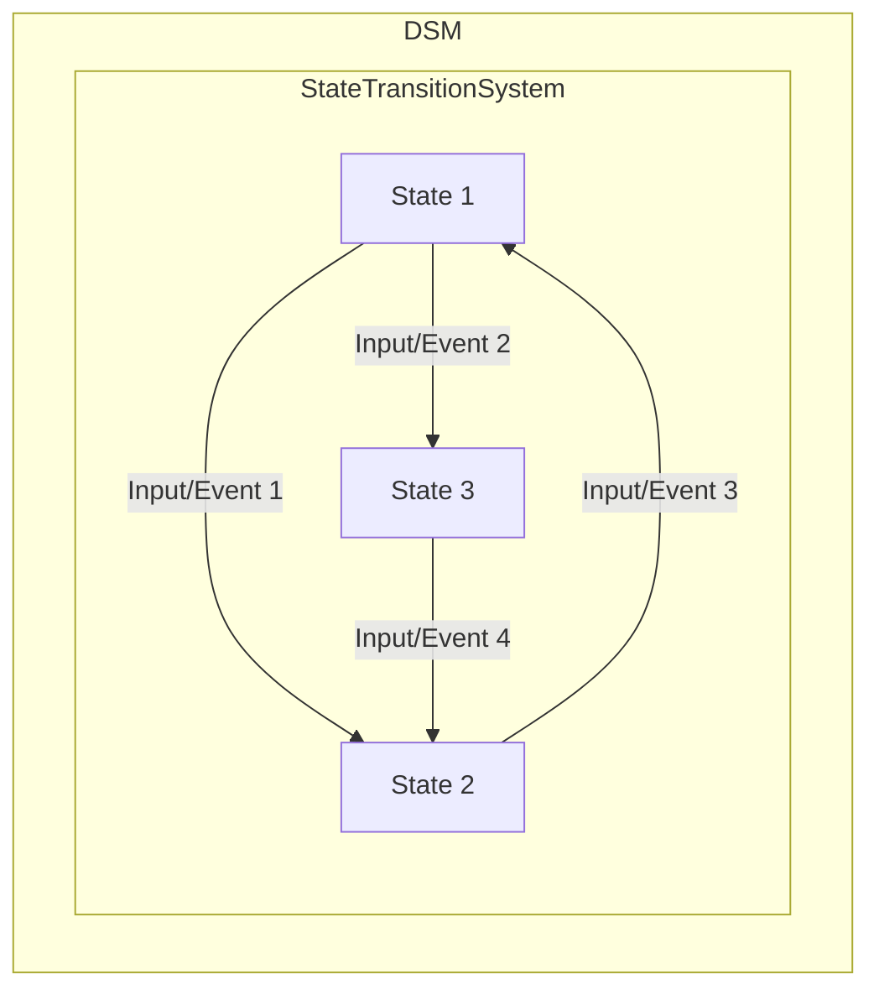
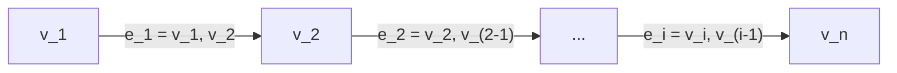

| Author(s)           | Key Contribution                                                           |
|---------------------|---------------------------------------------------------------------------|
| [Buterin](https://github.com/ethereum/wiki/wiki/White-Paper)             | Proposed the concept of a blockchain with a Turing-complete language.     |
| [Dwork and Naor](https://web.archive.org/web/20170810035254/http://www.wisdom.weizmann.ac.il/~naor/PAPERS/pvp.pdf)      | Introduced the idea of using "proof-of-work" for value transmission.       |
| [Adam Back](https://web.archive.org/web/20170810043047/http://www.hashcash.org/papers/amortizable.pdf)           | Developed a similar system using "proof-of-work."                        |
| [Vivek Vishnumurthy](https://web.archive.org/web/20170810031834/https://www.cs.cornell.edu/people/egs/papers/karma.pdf)  | Used "proof-of-work" for peer-to-peer file trading with security measures. |
| [Nakamoto](https://www.mail-archive.com/cryptography@metzdowd.com/msg09959.html)            | Created Bitcoin, the first widely adopted decentralized ledger.           |
| [Sprankel](https://web.archive.org/web/20170810025028/http://www.coderblog.de/wp-content/uploads/technical-basis-of-digital-currencies.pdf)            | Discussed Litecoin and Primecoin as Bitcoin alternatives.                |
| [Aron](http://www.sciencedirect.com/science/article/pii/S0262407912601055)                | Explored Namecoin, a decentralized name-resolution system.               |
| [Willet](https://web.archive.org/web/20170810035927/https://github.com/OmniLayer/spec)              | Proposed Mastercoin, a protocol with additional features on top of Bitcoin. |
| [Rosenfeld](https://web.archive.org/web/20180220235952/https://github.com/Colored-Coins/Colored-Coins-Protocol-Specification)           | Suggested Coloured Coins, allowing token creation and tracking in Bitcoin. |
| [Boutellier](https://web.archive.org/web/20170810040208/https://www.springer.com/gb/book/9783319040158)          | Discussed Ripple's "federated" system for currency exchange.              |
| [Szabo](https://web.archive.org/web/20170810042659/http://firstmonday.org/ojs/index.php/fm/article/view/548) and [Miller](https://drive.google.com/file/d/0Bw0VXJKBgYPMS0J2VGIyWWlocms/edit?usp=sharing).    | Early work on smart contracts, predicting their impact on cooperation.    |


























{% include alerts/info.html content="

## Discrete State Machine (DSM)

DSM can be formally expressed as $(\sum,S,s_o,\delta)$, where $\sum$ is the set of all possible states, $S$ is the set of possible states, $s_0$ is the initial state, and $\delta$ is the state-transition function that governs how the system moves between states based on specific conditions or events. It can be better explained as follows:

1. **State Transition System**: A DSM represents a system as a state transition system. This means that the system can exist in different states, and it can change from one state to another based on specific conditions or events.

2. **Set of Possible States (S)**: The DSM deals with a countable set of all the possible states the system can be in. This set is denoted as '$S$'. These states represent the various configurations or conditions based on the behaviours of the system.

3. **Initial State $(s_0)$**: Every DSM has an initial state, denoted as '$s_0$', which is one of the elements within the set of possible states '$S$'. It represents the starting point of the system's operation.

4. **State-Transition Function $(\delta)$**: The heart of a DSM is the state-transition function, represented as '$\delta$'. This function defines the rules or conditions under which the system can change from one state to another. It takes the current state as input and produces the next state as output.

5. **DSM Tuple**: To fully define a DSM, we use a tuple consisting of the following components:
   - '$\sum$' represents the countable set of all possible states.
   - '$S$' represents the set of possible states.
   - '$s_0$' is the initial state.
   - '$\delta$' is the state-transition function.



" %}


In the context of Polkadot Protocol, which is a distributed blockchain. The state-transition function in this case is implemented by the [Polkadot Runtime](#runtime).

{% include alerts/algorithm.html content="

## Path Graph

The concept of a **path graph**, often denoted as $P_n$ , finds its origins in graph theory. It represents a specific type of tree structure characterized by a linear arrangement of nodes. In a path graph, there are two nodes at the ends of the path with a degree of $1$, while the intermediate nodes, which total $n-2$ in number, have a degree of $2$.

In the case of a path graph, it can be thought of as a simple linear structure with nodes arranged in a particular way. This arrangement can be represented as a sequence of nodes or vertices $(v_1, v_2, \ldots, v_n)$, with edges defined as $e_i = (v_i, v_{i+1})$ for $1 \leq i \leq n-1$. This means that each node is connected to the next one in the sequence, forming a linear path.

```pseudocode
\begin{algorithm}
\caption{Aggregate-Key}
\begin{algorithmic}
    \require{$P_N \coloneqq ($\textsc{TrieRoot}$ = N_1, \dots, N_j = N)$}
    \state $pk^{Agr}_N \leftarrow \phi$
    \state $i \leftarrow 1$
    \forall{$N_i \in P_N$}
    \state $pk^{Agr}_N \leftarrow pk^{Agr}_N || pk_{N_i} || \textrm{Index}_{N_i}(N_{i + 1})$
    \endfor
    \state $pk^{Agr}_N \leftarrow pk^{Agr}_N || pk_{N}$
    \return $pk^{Agr}_N$
\end{algorithmic}
\end{algorithm}
```




" %}

```pseudocode
\begin{algorithm}
\caption{Aggregate-Key}
\begin{algorithmic}
    \require{$P_N \coloneqq ($\textsc{TrieRoot}$ = N_1, \dots, N_j = N)$}
    \state $pk^{Agr}_N \leftarrow \phi$
    \state $i \leftarrow 1$
    \forall{$N_i \in P_N$}
    \state $pk^{Agr}_N \leftarrow pk^{Agr}_N || pk_{N_i} || \textrm{Index}_{N_i}(N_{i + 1})$
    \endfor
    \state $pk^{Agr}_N \leftarrow pk^{Agr}_N || pk_{N}$
    \return $pk^{Agr}_N$
\end{algorithmic}
\end{algorithm}
```


```pseudocode
\begin{algorithm}
\caption{Validate-Transactions-and-Store}
\begin{algorithmic}
    \state $L \leftarrow Dec_{SC}(M_T)$
    \forall{$\{T \in L \mid T \notin TQ \mid T \notin TP\}$}
        \state $B_d \leftarrow$ \call{Head}{\call{Longest-Chain}{$BT$}}
        \state $N \leftarrow H_n(B_d)$
        \state $R \leftarrow$ \call{Call-Runtime-Entry}{$\texttt{TaggedTransactionQueue\_validate\_transaction}, N, T$}
        \if{\call{Valid}{$R$}}
            \if{\call{Requires}{$R$}$ \subset \bigcup_{\forall T \in (TQ~\cup~B_i \mid \exists i_{\mid d > i})}$ \call{Provided-Tags}{$T$}}
                \state \call{Insert-At}{$TQ, T, $\call{Requires}{$R$}$, $\call{Priority}{$R$}}
            \else
                \state \call{Add-To}{$TP,T$}
            \endif
            \state \call{Maintain-Transaction-Pool}{}
            \if{\call{ShouldPropagate}{$R$}}
                \state \call{Propagate}{$T$}
            \endif
        \endif
    \endfor
\end{algorithmic}
\end{algorithm}
```

